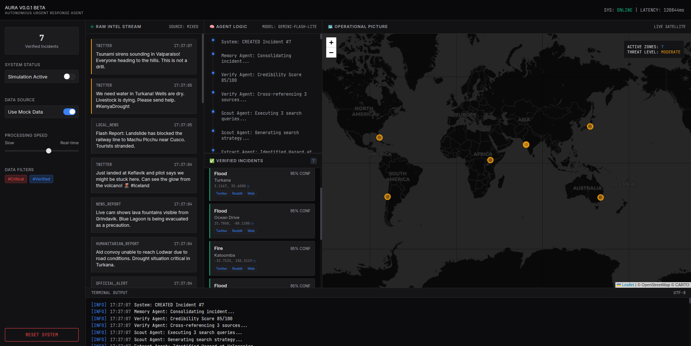
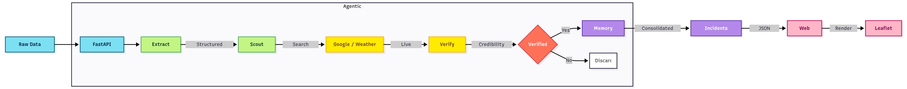

# AURA: Autonomous Urgent Response Agent 🛰️

> **Capstone Project Submission for Google AI Agents Intensive (Nov 2025)**
> **Track:** Agents for Good


 

[](https://youtu.be/LRcSJLLaq8k) 

## 🚨 The Problem
During natural disasters and emergencies, social media is flooded with information—some critical, some irrelevant, and some false. Emergency responders and humanitarian organizations struggle to filter this "noise" to find actionable intelligence in real-time. Manual verification is too slow when seconds count.

## 💡 The Solution
**AURA (Autonomous Urgent Response Agent)** is a multi-agent system that acts as a "God Mode" dashboard for disaster response. It autonomously monitors data streams, extracts critical incidents, verifies them against real-time web data, and consolidates them into a live operational picture.

### Key Features
- **Multi-Agent Architecture**: Specialized agents work in parallel to handle extraction, search, verification, and memory.
- **Real-Time Verification**: Cross-references social media reports with live Google Search results to filter misinformation.
- **Geospatial Intelligence**: Automatically geocodes vague location descriptions to plot incidents on an interactive map.
- **Memory Consolidation**: Intelligently merges duplicate reports about the same event to prevent data duplication.

## 🏗️ Architecture



AURA is built using the **Google AI Agent Development Kit (ADK)** and **Gemini 2.5 Flash**.

### The Agents
1.  **Extract Agent**: Uses `gemini-2.5-flash` to parse unstructured text (tweets, news) into structured JSON (Location, Type, Severity).
2.  **Scout Agent**: Generates targeted search queries (e.g., "site:twitter.com wildfire latest") to find corroborating evidence.
3.  **Verify Agent**: Analyzes search results to assign a credibility score (0-100) and filter out outdated or false information.
4.  **Memory Agent**: Manages the state, handling deduplication and merging updates for existing incidents.

## 🛠️ Tech Stack
- **LLM**: Google Gemini 2.5 Flash
- **Backend**: Python, FastAPI
- **Frontend**: Vanilla HTML/CSS/JS, Leaflet.js
- **Tools**: Google Search (Grounding), OpenWeatherMap API
- **Deployment**: Local / Cloud Run (Ready)

## 🚀 Getting Started

### Prerequisites
- Python 3.12+
- Google Cloud API Key (with Gemini API enabled)
- Google Maps API Key (optional, for geocoding)

### Installation

1.  **Clone the Repository**
    ```bash
    git clone https://github.com/yourusername/aura-agent.git
    cd aura-agent
    ```

2.  **Set up Environment**
    Copy the example environment file and add your keys:
    ```bash
    cp .env.example .env
    ```
    Edit `.env`:
    ```ini
    GOOGLE_API_KEY=your_gemini_api_key_here
    MAPS_API_KEY=your_google_maps_api_key_here
    GEMINI_MODEL_NAME=gemini-2.5-flash-exp
    GOOGLE_SEARCH_API_KEY=your_search_api_key  # Optional: For fallback search
    GOOGLE_SEARCH_CX=your_search_cx_id         # Optional: For fallback search
    OPEN_WEATHER_API=your_openweather_key      # Required: For verification
    ```

3.  **Run the Application**
    Helper scripts are provided to set up the virtual environment and start the app.

    **For Linux/macOS:**
    ```bash
    ./run.sh
    ```

    **For Windows:**
    ```cmd
    run.bat
    ```
    These scripts handle virtual environment creation, dependency installation, and server startup.

## 🎮 Usage
1.  Open the dashboard at `http://localhost:8000`.
2.  The system automatically starts processing the data stream.
3.  Watch as:
    - **Raw Intelligence** appears in the left column.
    - **Agent Brain** logs show the agents' thought processes (Extract -> Scout -> Verify).
    - **Verified Incidents** appear in the center with citations and confidence scores.
    - **Operational Picture** updates the map in real-time with interactive markers.

## 🔮 Future Scope & Roadmap
AURA is designed to scale. Future improvements include:
- **Global Firehose Integration**: Connecting to real-time APIs like GDELT, Twitter/X Firehose, and USGS Earthquake feeds for true global coverage.
- **Multimodal Analysis**: Upgrading the Extract Agent to analyze images and videos (e.g., flood depth estimation from photos) using Gemini 2.5 Vision.
- **Predictive Analytics**: Using historical data to predict disaster spread and resource needs.
- **Autonomous Dispatch**: Connecting verified incidents directly to emergency response dispatch systems.

## 🚧 Areas for Improvement
- **Error Recovery**: Implementing robust state persistence (PostgreSQL/Redis) to survive application restarts.
- **Asynchronous Processing**: Moving agent workflows to a task queue (Celery/Ray) to handle high-volume data streams without UI freezing.
- **Source Diversity**: Expanding verification beyond Google Search to include local news APIs, government alerts, and satellite imagery.

## 🛡️ Disclaimer
This project is a prototype for educational purposes. Always rely on official local authorities for emergency information.

---
*Built for the Google AI Agents Intensive Capstone 2025.*
